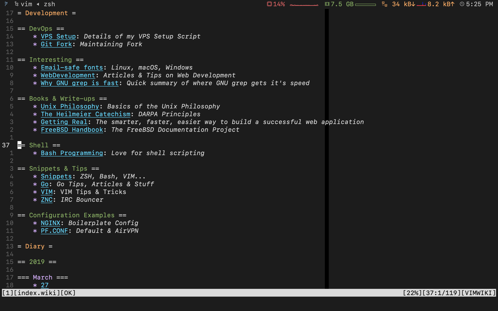

# iTerm2 Configuration

I'm not using it anymore, but users in macOS can benefit from this. After all it's best terminal emulator on available on macOS.

I moved to #iPadOnly workflow and switched to [Blink Shell](https://blink.sh).

